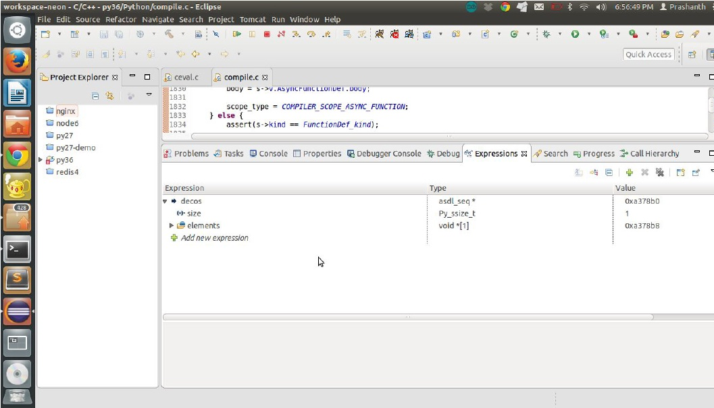
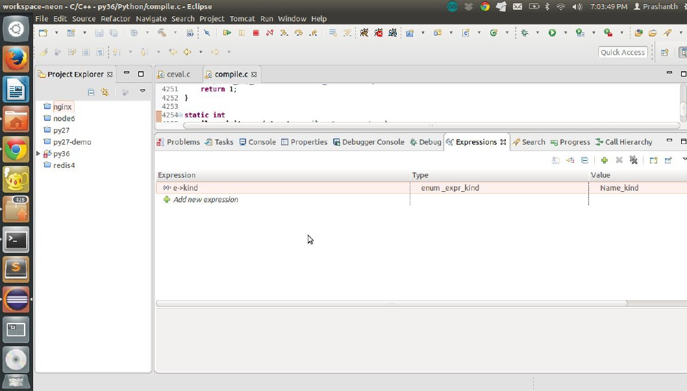

<h1 align="center"> Chapter  23  </h1>
 
<h2 align="center"> Understanding Decorators  </h2>

## Topic 12.1 Function decorators

Let us define a simple decorator function.

**Listing 12.1 a simple decorator function**

```python
def decorator_func ( original_function ):
def wrapper_function ():
print ( "Before")
original_function ()
print ( "After")
return wrapper_function

@decorator_func
def func ():
print ( "Hello")
func ()
The opcode equivalent of the above code
2 0 LOAD_CONST 0 (< code object decorator_func at 0x7f5575564c40 , file "decorator.py" , line 2 >)
2 LOAD_CONST 1 ( 'decorator_func')
4 MAKE_FUNCTION 0
6 STORE_NAME 0 ( decorator_func)
10 8 LOAD_NAME 0 ( decorator_func)
10 LOAD_CONST 2 (< code object func at 0x7f5575564e80 , file "decorator.py" , line 10 >)
12 LOAD_CONST 3 ( 'func')
14 MAKE_FUNCTION 0			// 1
16 CALL_FUNCTION 1			// 2
18 STORE_NAME 1 ( func )	        // 3
14 20 LOAD_NAME 1 ( func)
22 CALL_FUNCTION 0
24 POP_TOP
26 LOAD_CONST 4 ( None)
28 RETURN_VALUE
```

Let us understand the implementation of the opcode MAKE_FUNCTION

**Observation 1**

```python
TARGET ( MAKE_FUNCTION ) {
PyObject * qualname = POP (); // $
PyObject * codeobj = POP (); // $
PyFunctionObject * func = ( PyFunctionObject *)
PyFunction_NewWithQualName ( codeobj , f -> f_globals , qualname );
Py_DECREF ( codeobj );
Py_DECREF ( qualname );
if ( func == NULL ) {
goto error;
}
if ( oparg & 0x08 ) {
assert ( PyTuple_CheckExact ( TOP ()));
func -> func_closure = POP ();
}
if ( oparg & 0x04 ) {
assert ( PyDict_CheckExact ( TOP ()));
func -> func_annotations = POP ();
}
if ( oparg & 0x02 ) {
assert ( PyDict_CheckExact ( TOP ()));
func -> func_kwdefaults = POP ();
}
if ( oparg & 0x01 ) {
assert ( PyTuple_CheckExact ( TOP ()));
func -> func_defaults = POP ();
}
PUSH (( PyObject *) func ); // $
DISPATCH ();
}
```

The implementation pops out the name and code object of the constructed ‘func’ function and creates a PyFunctionObject and PUSHes the function on top of the current stack frame.

**Observation 2**

Let us understand the implementation of the CALL_FUNCTION opcode.

```python
TARGET ( CALL_FUNCTION ) {
PyObject ** sp , * res;
PCALL ( PCALL_ALL );
sp = stack_pointer;
res = call_function (& sp , oparg , NULL );
stack_pointer = sp;
PUSH ( res );
if ( res == NULL ) {
goto error;
}
DISPATCH ();
}
static PyObject *
call_function ( PyObject *** pp_stack , Py_ssize_t oparg , PyObject * kwnames)
{
PyObject ** pfunc = (* pp_stack ) - oparg - 1 ; // 1

1. The decorator function is fetched.
```

The argument to the function is the just constructed ‘func’ function.

**Observation 3**

1. The created function from the decorator is reassigned to the ‘func’ object.

**Listing 12.2 Example with multiple decorators**

```python
def decorator_func ( original_function ):
def wrapper_function ():
print ( "Before")
original_function ()
print ( "After")
return wrapper_function

@decorator_func
@decorator_func
def func ():
print ( "Hello")
func ()
2 0 LOAD_CONST 0 (< code object decorator_func at 0x7f8a6c7cac40 , file "decorator.py" , line 2 >)
2 LOAD_CONST 1 ( 'decorator_func')
4 MAKE_FUNCTION 0
6 STORE_NAME 0 ( decorator_func)
10 8 LOAD_NAME 0 ( decorator_func ) 		// 1
11 10 LOAD_NAME 0 ( decorator_func ) 		// 2
12 LOAD_CONST 2 (< code object func at 0x7f8a6c7cae80 , file "decorator.py" , line 10 >)
14 LOAD_CONST 3 ( 'func')
16 MAKE_FUNCTION 0
18 CALL_FUNCTION 1			// 3
20 CALL_FUNCTION 1			// 4
22 STORE_NAME 1 ( func )	        // 5
15 24 LOAD_NAME 1 ( func)
26 CALL_FUNCTION 0
28 POP_TOP
30 LOAD_CONST 4 ( None)
32 RETURN_VALUE
```

**Observation 1 and 2**

```pyhton
TARGET ( LOAD_NAME ) {
PyObject * name = GETITEM ( names , oparg );
PyObject * locals = f -> f_locals;
PyObject * v;
if ( locals == NULL ) {
PyErr_Format ( PyExc_SystemError, "no locals when loading %R" , name );
goto error;
}
if ( PyDict_CheckExact ( locals )) {
v = PyDict_GetItem ( locals , name );
Py_XINCREF ( v );
}
else {
v = PyObject_GetItem ( locals , name );
if ( v == NULL ) {
if (! PyErr_ExceptionMatches ( PyExc_KeyError ))
goto error;
PyErr_Clear ();
}
}
if ( v == NULL ) {
v = PyDict_GetItem ( f -> f_globals , name );
Py_XINCREF ( v );
if ( v == NULL ) {
if ( PyDict_CheckExact ( f -> f_builtins )) {
v = PyDict_GetItem ( f -> f_builtins , name );
if ( v == NULL ) {
format_exc_check_arg( PyExc_NameError, NAME_ERROR_MSG , name );
goto error;
}
Py_INCREF ( v );
}
else {
v = PyObject_GetItem ( f -> f_builtins , name );
if ( v == NULL ) {
if ( PyErr_ExceptionMatches ( PyExc_KeyError ))
format_exc_check_arg( PyExc_NameError, NAME_ERROR_MSG , name );
goto error;
}
}
}
}
PUSH ( v ); // $
DISPATCH ();
}

The decorator function is pushed into the stack frame twice . Let us consider this as f1 and f2.
```

**Observation 3 and 4**

```python
PREDICTED ( CALL_FUNCTION );
TARGET ( CALL_FUNCTION ) {
PyObject ** sp , * res;
PCALL ( PCALL_ALL );
sp = stack_pointer;
res = call_function (& sp , oparg , NULL );
stack_pointer = sp;
PUSH ( res ); 				// $
if ( res == NULL ) {
goto error;
}
DISPATCH ();
}
During the first call to the opcode CALL_FUNCTION the frame object f2 is used with the ' func ' code object as the argument . This result is pushed onto the stack frame as shown above let us call this deco1.

The frame object f1 is called to the opcode CALL_FUNCTION with the decorated function deco1 as argument . The result is stored in the object ' func '.
```
## Topic 12.2 Class decorators

**Listing 12.3 A simple class decorator**

```python
class decorating_class ( object ):

def __init__ ( self , deco_func ):
self . deco_ func = deco_func

def __call__ ( self ):
print ( "Entering" , self . deco_ func . __name__ )
self . deco_func ()
print ( "Exited" , self . deco_ func . __name__ )

@ decorating_class
def func1 ():
print ( "inside func1()")
Opcode of the above code
2 0 LOAD_BUILD_CLASS
2 LOAD_CONST 0 (< code object decorating_class at 0x7f28c41abc40 , file "decorator.py" , line 2 >)
4 LOAD_CONST 1 ( 'decorating_class')
6 MAKE_FUNCTION 0
8 LOAD_CONST 1 ( 'decorating_class')
10 LOAD_NAME 0 ( object)
12 CALL_FUNCTION 3
14 STORE_NAME 1 ( decorating_class)
12 16 LOAD_NAME 1 ( decorating_class)
18 LOAD_CONST 2 (< code object func1 at 0x7f28c41abe80 , file "decorator.py" , line 12 >)
20 LOAD_CONST 3 ( 'func1')
22 MAKE_FUNCTION 0
24 CALL_FUNCTION 1
26 STORE_NAME 2 ( func1)
17 28 LOAD_NAME 2 ( func1)
30 CALL_FUNCTION 0
32 POP_TOP
34 LOAD_CONST 4 ( None)
36 RETURN_VALUE
```

We observe that the opcode implementation is exactly similar to the function based decorators.

Code sample from:
[http://python-3-patterns-idioms-test.readthedocs.io/en/latest/PythonDecorators.html](http://python-3-patterns-idioms-test.readthedocs.io/en/latest/PythonDecorators.html)

## Topic 12.3 Compilation of a function with decorators

The construction of a function with decorators is done in the function compile_function defined in compile.c on line no 1808.

Snippet of the function

```python
if ( is_async ) {
assert ( s -> kind == AsyncFunctionDef_kind );
args = s -> v . AsyncFunctionDef . args;
returns = s -> v . AsyncFunctionDef . returns;
decos = s -> v . AsyncFunctionDef . decorator_list;
name = s -> v . AsyncFunctionDef . name;
body = s -> v . AsyncFunctionDef . body;
scope_type = COMPILER_SCOPE_ASYNC_FUNCTION;
}
else {
assert ( s -> kind == FunctionDef_kind );
args = s -> v . FunctionDef . args;
returns = s -> v . FunctionDef . returns;
decos = s -> v . FunctionDef . decorator_list ; 	// 1
name = s -> v . FunctionDef . name;
body = s -> v . FunctionDef . body;
scope_type = COMPILER_SCOPE_FUNCTION;
}
if (! compiler_decorators ( c , decos )) 			// 2
```

The function compiler_decorators is called for each of the decorators of the function.

**_Debugging session_**

Insert a breakpoint on line no 1845 and execute the following code in the interpreter.

```python
class decorating_class ( object ):
def __init__ ( self , deco_func ):
self . deco_ func = deco_func
def __call__ ( self ):
print ( "Entering" , self . deco_ func . __name__ )
self . deco_func ()
print ( "Exited" , self . deco_ func . __name__ )
@ decorating_class
def func1 ():
print ( "inside func1()")
```

We see that the debugger is trapped with the size of the decos array being 1.



For each of the elements in the decos asdl_seq the function compiler_decorators is executed.

compile.c line no 1608 insert a breakpoint.

```python
static int
compiler_decorators ( struct compiler * c , asdl_seq * decos)
{
int i;
if (! decos)
return 1;
for ( i = 0 ; i < asdl_seq_LEN ( decos ); i ++) {
VISIT ( c , expr , ( expr_ty ) asdl_seq_GET ( decos , i ));
}
return 1;
}

It internally calls the function compiler_visit_expr with kind of expression being NameKind.
```


**_Debugging session_**



```python
case Name_kind:
return compiler_nameop ( c , e -> v . Name . id , e -> v . Name . ctx );  /* child nodes of List and Tuple will have expr_context set */
case List_kind:
return compiler_list ( c , e );
case Tuple_kind:
return compiler_tuple ( c , e );
}
```

Insert a breakpoint in the function compiler_nameop on line no 3041

```python
op = 0;
optype = OP_NAME;
scope = PyST_GetScope ( c -> u -> u_ste , mangled );
switch ( scope ) {
case FREE:
dict = c -> u -> u_freevars;
optype = OP_DEREF;
break;

It is observed that the scope is GLOBAL value set to 3.
```

```python
case GLOBAL_IMPLICIT:
if ( c -> u -> u_ste -> ste_type == FunctionBlock)
optype = OP_GLOBAL;
break;
```

But since it is not a function block the optype remains OP_NAME.

```python
case OP_NAME:
switch ( ctx ) {
case Load : op = LOAD_NAME ; break;
case Store : op = STORE_NAME ; break;
case Del : op = DELETE_NAME ; break;
case AugLoad:
case AugStore:
break;
case Param:
default:
PyErr_SetString ( PyExc_SystemError, "param invalid for name variable" );
return 0;
}
break;
}
```

ctx points to Load and hence the opcode to be generated is LOAD_NAME.

```python
arg = compiler_add_o ( c , dict , mangled );
Py_DECREF ( mangled );
if ( arg < 0)
return 0;
return compiler_addop_i ( c , op , arg );
```

Now we understand how the LOAD_NAME opcode is generated for every decorator added to the function.

Now let us understand how the CALL_FUNCTION opcodes are generated. compile.c line no 1901.

```python
co = assemble ( c , 1 ); // 1
qualname = c -> u -> u_qualname;
Py_INCREF ( qualname );
compiler_exit_scope ( c );
if ( co == NULL ) {
Py_XDECREF ( qualname );
Py_XDECREF ( co );
return 0;
}
compiler_make_closure ( c , co , funcflags , qualname );
Py_DECREF ( qualname );
Py_DECREF ( co );		/* decorators */
for ( i = 0 ; i < asdl_seq_LEN ( decos ); i ++) {
ADDOP_I ( c , CALL_FUNCTION , 1 );
}
```

This piece of code is executed after the construction of code object as shown in 1.

Now we understand how the LOAD_NAME and CALL_FUNCTION for each decorators are generated for every function.

That’s about decorators. Hope you enjoyed the chapter.
