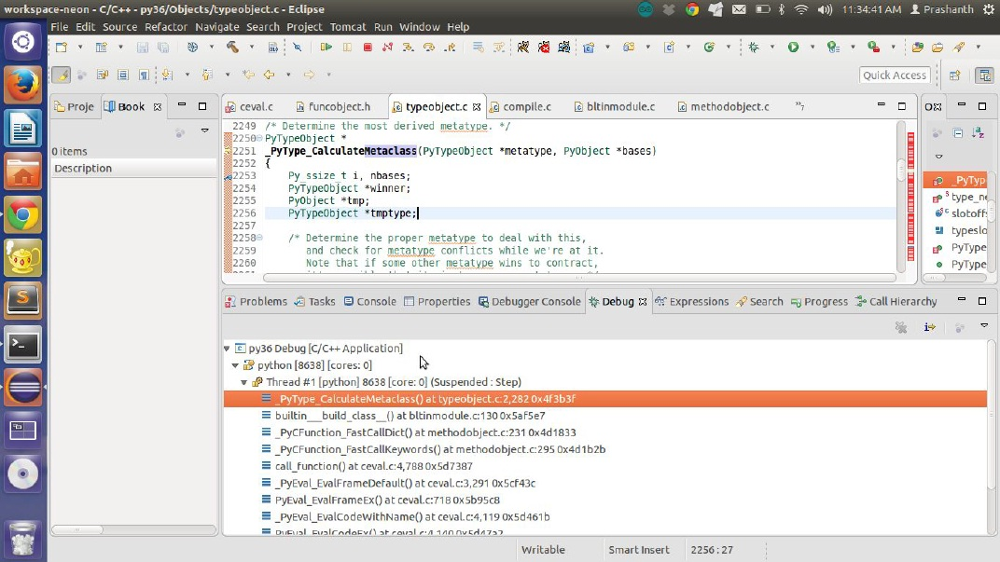
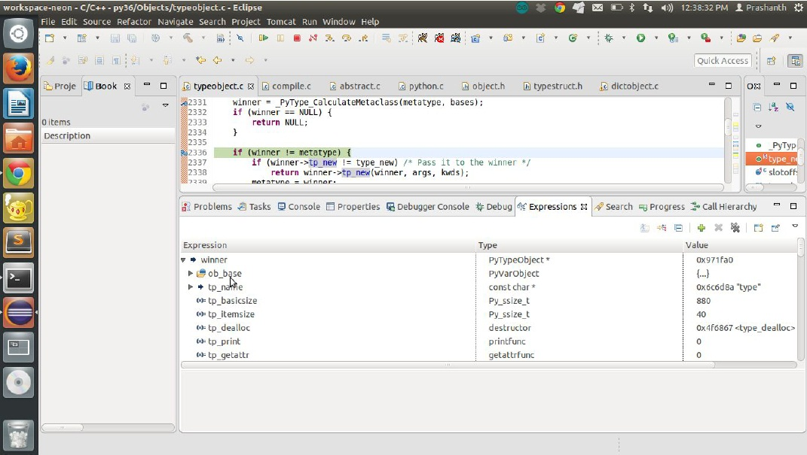
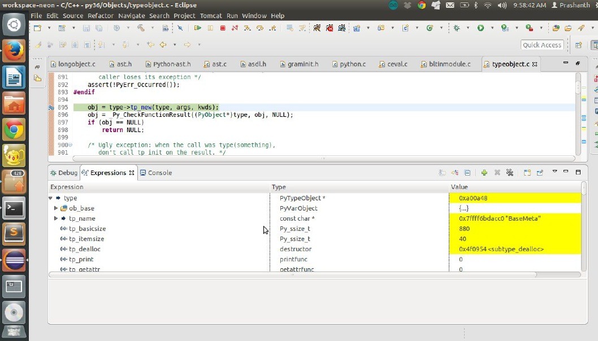

<h1 align="center"> Chapter  24  </h1>
 
<h2 align="center"> Python metaprogramming  </h2>

Metaclasses are used to create classes and classes are used to create instances. All classes in python are of the python type ‘type’.

```
>>> class c:
... pass
...
>>> type ( c)
<class 'type'>
```

The function type is used to create new types in other words it acts as a metaclass builder.

For example:

```
C = type ( 'C' , (), {})
Create a class with name C with no base classes and no methods or data
objects.
```

The other way to create a metaclass generator in Python 3.x is to extend the base class type.

```
class BaseMeta ( type ):
	def __init__ ( cls , name , baseClasses , namespace ):
		super ( BaseMeta , cls ) . __init__ ( name , baseClasses , namespace )
		cls . use_meta = lambda self : "Yes!"

class MetaExample ( object , metaclass = BaseMeta ):
		pass
```

The metaclass for a class is determined by the function __PyType_CalculateMetaclass in the file typeobject.c on line no 2251._

```
PyTypeObject *
_PyType_CalculateMetaclass ( PyTypeObject * metatype , PyObject * bases)
{
Py_ssize_t i , nbases;
PyTypeObject * winner;
PyObject * tmp;
PyTypeObject * tmptype;

/* Determine the proper metatype to deal with this, and check for metatype conflicts while we 're at it. Note that if some other metatype wins to contract, it 's possible that its instances are not types. */

	nbases = PyTuple_GET_SIZE ( bases );
	winner = metatype;
	for ( i = 0 ; i < nbases ; i ++) {
		tmp = PyTuple_GET_ITEM ( bases , i );
		tmptype = Py_TYPE ( tmp );
		if ( PyType_IsSubtype ( winner , tmptype ))
		continue;
		if ( PyType_IsSubtype ( tmptype , winner )) {
		winner = tmptype;
		continue;
}

/* else: */

PyErr_SetString ( PyExc_TypeError,
				  "metaclass conflict: "
				  "the metaclass of a derived class "
				  "must be a (non-strict) subclass "
				  "of the metaclasses of all its bases" );
	return NULL;
  }
   return winner;
}
```

**Debugging session**

Explore the example.

```
class ExampleMeta ( object , metaclass = BaseMeta ):
pass
type ( ExampleMeta)
<class '__main__.BaseMeta'>
```


It is called by the function build class which is defined in the file bltinmodule.c. Therefore we observe that the new class is of the type BaseMeta.

Let us now understand how the new type object is constructed for the class BaseMeta.

_Listing 21.1 The base type of all classes typeobject.c line no 3356_

```
PyTypeObject PyType_Type = {
PyVarObject_HEAD_INIT (& PyType_Type , 0)

"type" , 						/* tp_name */
sizeof ( PyHeapTypeObject ), 				/* tp_basicsize */
sizeof ( PyMemberDef ), 				/* tp_itemsize */
( destructor ) type_dealloc , 				/* tp_dealloc */
0 , 							/* tp_print */
0 , 							/* tp_getattr */
0 , 							/* tp_setattr */
0 , 							/* tp_reserved */
( reprfunc ) type_repr , 				/* tp_repr */
0 , 							/* tp_as_number */
0 , 							/* tp_as_sequence */
0 , 							/* tp_as_mapping */
0 , 							/* tp_hash */
( ternaryfunc ) type_call , 				/* tp_call */
0 , 							/* tp_str */
( getattrofunc ) type_getattro , 			/* tp_getattro */
( setattrofunc ) type_setattro , 			/* tp_setattro */
0 , 							/* tp_as_buffer */

Py_TPFLAGS_DEFAULT | Py_TPFLAGS_HAVE_GC | Py_TPFLAGS_BASETYPE | Py_TPFLAGS_TYPE_SUBCLASS , 		/* tp_flags */

type_doc , 								/* tp_doc */
( traverseproc ) type_traverse , 					/* tp_traverse */
( inquiry ) type_clear , 						/* tp_clear */
0 , 									/* tp_richcompare */
offsetof ( PyTypeObject , tp_weaklist ), 				/* tp_weaklistoffset */
0 , 									/* tp_iter */
0 , 									/* tp_iternext */
type_methods , 								/* tp_methods */
type_members , 								/* tp_members */
type_getsets , 								/* tp_getset */
0 , 									/* tp_base */
0 , 									/* tp_dict */
0 , 									/* tp_descr_get */
0 , 									/* tp_descr_set */
offsetof ( PyTypeObject , tp_dict ), 					/* tp_dictoffset */
type_init , 								/* tp_init */
0 , 									/* tp_alloc */
type_new , 								/* tp_new */
PyObject_GC_Del , 							/* tp_free */
( inquiry ) type_is_gc , 						/* tp_is_gc */
};
```

Let us debug the function type_new in the file typeobject.c line no 2286.

```
winner = _PyType_CalculateMetaclass ( metatype , bases );
if ( winner == NULL ) {
return NULL;
}
if ( winner != metatype ) {
if ( winner -> tp_new != type_new ) 			/* Pass it to the winner */
return winner -> tp_new ( winner , args , kwds );
metatype = winner;
}
```

Let us consider the example

```
class BaseMeta ( type ):
pass
```



Let us now understand how a class is constructed with a metaclass.

```
class ExampleMeta ( object , metaclass = BaseMeta ):
pass
type ( ExampleMeta)
<class '__main__.BaseMeta' >
```



So we see that the class that builds the new class is not of the type type but the metaclass BaseMeta.

Author’s take on the basics of metaprogramming.

This chapter is just to mention the role of metaclasses in the construction of other classes.

Let us take a simple example.

```
class BaseMeta ( type ):
	def __init__ ( cls , name , baseClasses , namespace ):
		super ( BaseMeta , cls ) . __init__ ( name , baseClasses , namespace )
		cls . use_meta = lambda self : "Yes!"

class MetaExample ( object , metaclass = BaseMeta ):
pass
```

We see that the class BaseMeta takes in three arguments other than the class object to be modified. which internally calls the init method of the type supertype which is nothing but a call to the function type_call.

**In simple terms:**

Classes modify the state of their instances while metaclasses modify the state of the classes they are building.
