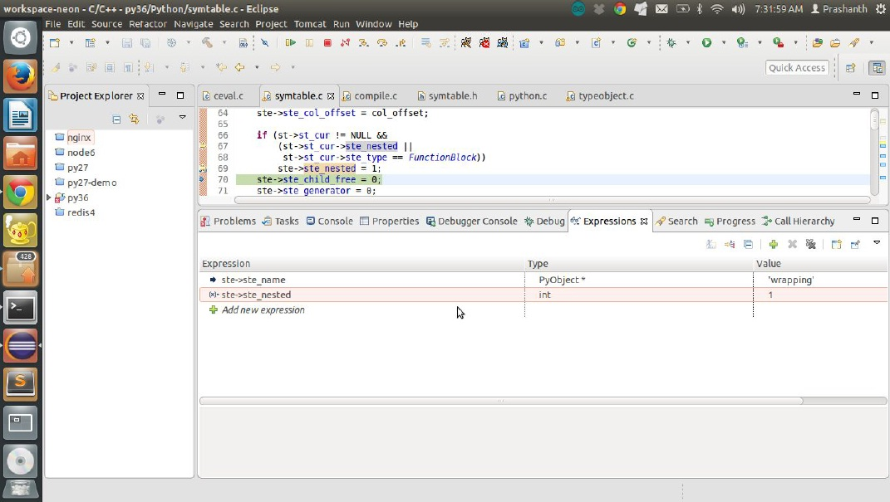

<h1 style="text-align: center;" markdown="1">Chapter 4</h1>
<h2 style="text-align: center;" markdown="2">Advanced Symbol table generation concepts</h2>

### Listing 3.1 The symbol table structures

**_symtable.h line no 18_**

```
struct symtable {
PyObject * st_filename ; 	/* name of file being compiled,decoded from the  filesystem encoding */

struct _symtable_entry * st_cur ; 	/* current symbol table entry */
struct _symtable_entry * st_top ; 	/* symbol table entry for module */
PyObject * st_blocks ; 				/* dict: map AST node addresses to symbol table entries */

PyObject * st_stack ; 				/* list: stack of namespace info */
PyObject * st_global ;			 /* borrowed ref to st_top->ste_symbols*/
int st_nblocks ; 				/* number of blocks used. kept for consistency with the corresponding compiler structure */

PyObject * st_private ; 		/* name of current class or NULL */
PyFutureFeatures * st_future ; 	   /* module's future features that affect the symbol table */

int recursion_depth ; 			/* current recursion depth */
int recursion_limit ; 			/* recursion limit */
};

typedef struct _symtable_entry {
PyObject_HEAD
PyObject * ste_id ; 			/* int: key in ste_table->st_blocks */
PyObject * ste_symbols ;		 /* dict: variable names to flags */
PyObject * ste_name ; 			/* string: name of current block */
PyObject * ste_varnames ; 		/* list of function parameters */
PyObject * ste_children ; 		/* list of child blocks */
PyObject * ste_directives ;		/* locations of global and nonlocal  statements */

_Py_block_ty ste_type ; 		/* module, class, or function */
int ste_nested ; 				/* true if block is nested */
unsigned ste_free : 1 ; 		/* true if block has free variables */
unsigned ste_child_free : 1 ; 	/* true if a child block has free vars, including free refs to globals */

unsigned ste_generator : 1 ; 		/* true if namespace is a generator */
unsigned ste_coroutine : 1 ; 		/* true if namespace is a coroutine */
unsigned ste_varargs : 1 ; 			/* true if block has varargs */
unsigned ste_varkeywords : 1 ; 		/* true if block has varkeywords */
unsigned ste_returns_value : 1 ; 	/* true if namespace uses return with an argument */

unsigned ste_needs_class_closure : 1 ; 	/* for class scopes, true if a closure over __class__ should be created */

int ste_lineno ; 			/* first line of block */
int ste_col_offset ; 		/* offset of first line of block */
int ste_opt_lineno ; 			/* lineno of last exec or import * */
int ste_opt_col_offset ;     /* offset of last exec or import * */
int ste_tmpname ; 			/* counter for listcomp temp vars */
struct symtable * ste_table;
} PySTEntryObject;

```

A symbol table is a dictionary of symbol table entries with an entry for each of the following.

A symbol table entry is created using the following function defined in **_symtable.c line no 936_**

```
static int
symtable_enter_block ( struct symtable * st , identifier name , _Py_block_tyblock, void * ast , int lineno , int col_offset)
{
PySTEntryObject * prev = NULL , * ste;
ste = ste_new ( st , name , block , ast , lineno , col_offset ); 	// 1
if ( ste == NULL)
return 0;
if ( PyList_Append ( st -> st_stack , ( PyObject *) ste ) < 0 ) 	// 2
{ 	
Py_DECREF ( ste );
return 0;
}
prev = st -> st_cur;
/* The entry is owned by the stack. Borrow it for st_cur. */
Py_DECREF ( ste );
st -> st_cur = ste ; 										// 3
if ( block == ModuleBlock)
st -> st_global = st -> st_cur -> ste_symbols;
if ( prev ) {
if ( PyList_Append ( prev -> ste_children , ( PyObject *) ste ) < 0 )  // 4
{
return 0;
}
}
return 1;
}

1. Create a new symbol table entry for the current block.
2. Add the current entry to the stack of entries.
3. The symbol table entries for the current block is setup.
4. A tree structure is formed for each level

```

**_symtable.c line no 29_**

```

static PySTEntryObject *
ste_new ( struct symtable * st , identifier name , _Py_block_ty block, void * key , int lineno , int col_offset)
{
PySTEntryObject * ste = NULL;
PyObject * k = NULL;
k = PyLong_FromVoidPtr ( key );
if ( k == NULL)
goto fail;
ste = PyObject_New ( PySTEntryObject , & PySTEntry_Type );
if ( ste == NULL ) {
Py_DECREF ( k );
goto fail;
}
ste -> ste_table = st;
ste -> ste_id = k ; 			/* ste owns reference to k */
Py_INCREF ( name );
ste -> ste_name = name;
ste -> ste_symbols = NULL;
ste -> ste_varnames = NULL;
ste -> ste_children = NULL;
ste -> ste_directives = NULL;
ste -> ste_type = block;
ste -> ste_nested = 0;
ste -> ste_free = 0;
ste -> ste_varargs = 0;
ste -> ste_varkeywords = 0;
ste -> ste_opt_lineno = 0;
ste -> ste_opt_col_offset = 0;
ste -> ste_tmpname = 0;
ste -> ste_lineno = lineno;
ste -> ste_col_offset = col_offset;
if ( st -> st_cur != NULL &&
( st -> st_cur -> ste_nested || st -> st_cur -> ste_type == FunctionBlock ))
ste -> ste_nested = 1;
ste -> ste_child_free = 0;
ste -> ste_generator = 0;
ste -> ste_coroutine = 0;
ste -> ste_returns_value = 0;
ste -> ste_needs_class_closure = 0;
ste -> ste_symbols = PyDict_New ();
ste -> ste_varnames = PyList_New ( 0 );
ste -> ste_children = PyList_New ( 0 );
if ( ste -> ste_symbols == NULL
|| ste -> ste_varnames == NULL
|| ste -> ste_children == NULL)
goto fail;
if ( PyDict_SetItem ( st -> st_blocks , ste -> ste_id , ( PyObject *) ste ) < 0)
goto fail;
return ste;
fail:
Py_XDECREF ( ste );
return NULL;
}

```

Let us now understand when symbol table entries are created.

```
if (! GET_IDENTIFIER ( top ) || ! symtable_enter_block ( st , top ,ModuleBlock , ( void *) mod , 0 , 0 )) 
{
PySymtable_Free ( st );
return NULL;
}
Purpose : for the module
if (! symtable_enter_block ( st , s -> v . FunctionDef . name, FunctionBlock,( void *) s , s -> lineno, s -> col_offset ))
Purpose : for a function
if (! symtable_enter_block ( st , s -> v . ClassDef . name , ClassBlock,( void *) s , s -> lineno , s -> col_offset ))
Purpose : for a class
if (! symtable_enter_block ( st , s -> v . AsyncFunctionDef . name, FunctionBlock , ( void *) s , s -> lineno, s -> col_offset ))
Purpose : for a async function
if (! symtable_enter_block ( st , lambda, FunctionBlock , ( void *) e , e -> lineno, e -> col_offset ))
Purpose : for lambda functions
if (! scope_name ||! symtable_enter_block ( st , scope_name , FunctionBlock , ( void *) e, e -> lineno , e -> col_offset )) {
return 0;
}
Purpose : for comprehensions

```

Therefore we understand that a module, function, class , lambda and comprehensions have
their own symbol table entries.  

**Topic: Fields of the symbol table entry**

Field 1
```
PyObject * ste_symbols ;   /* dict: variable names to flags */
```

The main object of the symbol table entry which contains the name of the variable to the
type.

Example:
```
if (! symtable_add_def ( st , s -> v . FunctionDef . name , DEF_LOCAL ))
```

An entry is added to the ste_symbols for the name of the function to the flag DEF_LOCAL.

Field 2
```
PyObject * ste_varnames ; /* list of function parameters */
```

If the symbols are also parameters to a function add them to this list.

Example:
```
if ( flag & DEF_PARAM ) {
if ( PyList_Append ( st -> st_cur -> ste_varnames , mangled ) < 0)
goto error;
} 
else if ( flag & DEF_GLOBAL ) {
```

Field 3
```
PyObject * ste_children ; /* list of child blocks */
```

List of children blocks for the current block.

Field 4
```
PyObject * ste_directives ; /* locations of global and nonlocal statements */
```

Example:
```
case Global_kind : {
int i;
asdl_seq * seq = s -> v . Global . names;
for ( i = 0 ; i < asdl_seq_LEN ( seq ); i ++) {
identifier name = ( identifier ) asdl_seq_GET ( seq , i );
long cur = symtable_lookup ( st , name );
if ( cur < 0)
VISIT_QUIT ( st , 0 );
if ( cur & ( DEF_LOCAL | USE | DEF_ANNOT )) {
char * msg;
if ( cur & USE ) {
msg = GLOBAL_AFTER_USE;
} 
else if ( cur & DEF_ANNOT ) {
msg = GLOBAL_ANNOT;
} 
else { /* DEF_LOCAL */
msg = GLOBAL_AFTER_ASSIGN;
}
PyErr_Format ( PyExc_SyntaxError, msg , name );
PyErr_SyntaxLocationObject ( st -> st_filename, s -> lineno, s -> col_offset );
VISIT_QUIT ( st , 0 );
}
if (! symtable_add_def ( st , name , DEF_GLOBAL ))
VISIT_QUIT ( st , 0 );
if (! symtable_record_directive ( st , name , s )) // 1
VISIT_QUIT ( st , 0 );
}
break;
}
static int
symtable_record_directive ( struct symtable * st , identifier name , stmt_ty s)
{
PyObject * data , * mangled;
int res;
if (! st -> st_cur -> ste_directives ) {
st -> st_cur -> ste_directives = PyList_New ( 0 );
if (! st -> st_cur -> ste_directives)
return 0;
}
mangled = _Py_Mangle ( st -> st_private , name );
if (! mangled)
return 0;
data = Py_BuildValue ( "(Nii)" , mangled , s -> lineno , s -> col_offset );
if (! data)
return 0;
res = PyList_Append ( st -> st_cur -> ste_directives , data ); // 2
Py_DECREF ( data );
return res == 0;
}
1. symtable_record_directive is used to add the value to the directive.
2. The directives are a list of values
```

**Flag 5**
```
int ste_nested ;
```
Is set to true if the block is nested

Example:
```
def wrapper ( func ):
def wrapping ():
print ( "Inside wrapping")
func ()
return wrapping

symtable . c line no 66

if ( st -> st_cur != NULL &&
( st -> st_cur -> ste_nested ||
st -> st_cur -> ste_type == FunctionBlock ))
ste -> ste_nested = 1;

If there are no parent blocks then ste -> ste_nested is set to 1 
```

Screenshot



We see that for the wrapping function ste_nested is set to 1. 

How is the flag used ?

**_compile.c line no 5166_**
```
static int
compute_code_flags ( struct compiler * c)
{
PySTEntryObject * ste = c -> u -> u_ste;
int flags = 0;
Py_ssize_t n;
if ( ste -> ste_type == FunctionBlock ) {
flags |= CO_NEWLOCALS | CO_OPTIMIZED;
if ( ste -> ste_nested)
flags |= CO_NESTED ; // 1 The CO_NESTED flag is set
if ( ste -> ste_generator && ! ste -> ste_coroutine)
flags |= CO_GENERATOR;
….
}
```

Flag 6
```
unsigned ste_generator : 1 ; /* true if namespace is a generator */
unsigned ste_coroutine : 1 ; /* true if namespace is a coroutine */

case Yield_kind:
	if ( e -> v . Yield . value)
	VISIT ( st , expr , e -> v . Yield . value );
	st -> st_cur -> ste_generator = 1;
	break;
case YieldFrom_kind:
	VISIT ( st , expr , e -> v . YieldFrom . value );
	st -> st_cur -> ste_generator = 1;
	break;
case Await_kind:
	VISIT ( st , expr , e -> v . Await . value );
	st -> st_cur -> ste_coroutine = 1;
	break;
```

How are the flags used ?

**_compile.c line no 2092_**
```
if ( c -> u -> u_ste -> ste_generator ) {
co = assemble ( c , 0 );
}
else {
ADDOP_IN_SCOPE ( c , RETURN_VALUE ); 		// 1
co = assemble ( c , 1 );
}
1. Return value is added for lambdas which are not generators.
```

Exercise:

Trace the following flags and post you answers to the author
```
unsigned ste_varargs : 1 ; 		/* true if block has varargs */
unsigned ste_varkeywords : 1 ; 		/* true if block has varkeywords */
unsigned ste_returns_value : 1 ; 		/* true if namespace uses return with an argument */
unsigned ste_needs_class_closure : 1 ; 	/* for class scopes, true if a closure over __class__ should be created */
```

**Topic: How are entries added to the symbol table**

Let us take a simple function as our example

Insert a breakpoint at line no **_symtable.c line no 1152_**
```
def multiplier ( a , b ):
return a * b

case FunctionDef_kind:
	if (! symtable_add_def ( st , s -> v . FunctionDef . name , DEF_LOCAL ))
	VISIT_QUIT ( st , 0 );
	if ( s -> v . FunctionDef . args -> defaults)
	VISIT_SEQ ( st , expr , s -> v . FunctionDef . args -> defaults );
	if ( s -> v . FunctionDef . args -> kw_defaults)
	VISIT_SEQ_WITH_NULL ( st , expr ,
s -> v . FunctionDef . args -> kw_defaults );
	if (! symtable_visit_annotations ( st , s , s -> v . FunctionDef  args,s -> v . FunctionDef . returns ))
	VISIT_QUIT ( st , 0 );
	if ( s -> v . FunctionDef . decorator_list)
	VISIT_SEQ ( st , expr , s -> v . FunctionDef . decorator_list );
	if (! symtable_enter_block ( st , s -> v . FunctionDef . name,
	FunctionBlock , ( void *) s , s -> lineno, s -> col_offset ))
	VISIT_QUIT ( st , 0 );
	VISIT ( st , arguments , s -> v . FunctionDef . args );
	VISIT_SEQ ( st , stmt , s -> v . FunctionDef . body );
	if (! symtable_exit_block ( st , s ))
	VISIT_QUIT ( st , 0 );
	break;
```


We see that there are two arguments.
```
VISIT ( st , arguments , s -> v . FunctionDef . args );
#define VISIT ( ST , TYPE , V ) \
if (! symtable_visit_ ## TYPE((ST), (V))) \
VISIT_QUIT (( ST ), 0 );
static int
symtable_visit_arguments ( struct symtable * st , arguments_ty a)
{
/* skip default arguments inside function block
XXX should ast be different?
*/
if ( a -> args && ! symtable_visit_params ( st , a -> args )) // 1
return 0;
if ( a -> kwonlyargs && ! symtable_visit_params ( st , a -> kwonlyargs ))
return 0;
if ( a -> vararg ) {
if (! symtable_add_def ( st , a -> vararg -> arg , DEF_PARAM ))
return 0;
st -> st_cur -> ste_varargs = 1;
}
if ( a -> kwarg ) {
if (! symtable_add_def ( st , a -> kwarg -> arg , DEF_PARAM ))
return 0;
st -> st_cur -> ste_varkeywords = 1;
}
return 1;
}
```

Observation 1

**_Symtable.c line no 1538_**
```
static int
symtable_visit_params ( struct symtable * st , asdl_seq * args)
{
int i;
if (! args)
return - 1;
for ( i = 0 ; i < asdl_seq_LEN ( args ); i ++) {
arg_ty arg = ( arg_ty ) asdl_seq_GET ( args , i );
if (! symtable_add_def ( st , arg -> arg , DEF_PARAM ))
return 0;
}
return 1;
}
static int
symtable_add_def ( struct symtable * st , PyObject * name , int flag)
{
PyObject * o;
PyObject * dict;
long val;
PyObject * mangled = _Py_Mangle ( st -> st_private , name );
if (! mangled)
return 0;
dict = st -> st_cur -> ste_symbols;
if (( o = PyDict_GetItem ( dict , mangled ))) {
val = PyLong_AS_LONG ( o );
if (( flag & DEF_PARAM ) && ( val & DEF_PARAM )) {    /* Is it better to use 'mangled' or 'name' here? */
PyErr_Format ( PyExc_SyntaxError , DUPLICATE_ARGUMENT , name );
PyErr_SyntaxLocationObject ( st -> st_filename,
st -> st_cur -> ste_lineno,
st -> st_cur -> ste_col_offset );
goto error;
}
val |= flag;
} else
val = flag;
o = PyLong_FromLong ( val );
if ( o == NULL)
goto error;
if ( PyDict_SetItem ( dict , mangled , o ) < 0 ) {   // 1
Py_DECREF ( o );
goto error;
}
Py_DECREF ( o );
if ( flag & DEF_PARAM ) {
if ( PyList_Append ( st -> st_cur -> ste_varnames , mangled ) < 0 )   // 2
goto error;
} else if ( flag & DEF_GLOBAL ) {       /* XXX need to update DEF_GLOBAL for other flags too;
perhaps only DEF_FREE_GLOBAL */
val = flag;
if (( o = PyDict_GetItem ( st -> st_global , mangled ))) {
val |= PyLong_AS_LONG ( o );
}
o = PyLong_FromLong ( val );
if ( o == NULL)
goto error;
if ( PyDict_SetItem ( st -> st_global , mangled , o ) < 0 ) {
Py_DECREF ( o );
goto error;
}
Py_DECREF ( o );
}
Py_DECREF ( mangled );
return 1;
error:
Py_DECREF ( mangled );
return 0;
}
1. The symbol is added to the symbols.
2. Since it is a parameter it is also added to the variable names.
```

Exercise:

Trace the symbol table creation for the following piece of logic
```
VISIT_SEQ ( st , stmt , s -> v . FunctionDef . body );
```

Please post your answers and email to the author :).

How is block exited?

**_Symtable.c line no 921_**
```
int symtable_exit_block ( struct symtable * st , void * ast)
{
Py_ssize_t size;
st -> st_cur = NULL;
size = PyList_GET_SIZE ( st -> st_stack );
if ( size ) {
if ( PyList_SetSlice ( st -> st_stack , size - 1 , size , NULL ) < 0 ) // 1
return 0;
if (-- size)
st -> st_cur = ( PySTEntryObject *) PyList_GET_ITEM ( st -> st_stack ,
size - 1 ); // 2
}
return 1;
}
1. Remove the block of the stack
2. Assign the current block to the parent.
```

**Topic How are symbol table entries used ?**

The compiler unit for the current block contains the current symbol table entry.
```
struct compiler_unit {
PySTEntryObject * u_ste ; // 1
PyObject * u_name;
PyObject * u_qualname ; /* dot-separated qualified name (lazy) */
int u_scope_type;
….
}
1. The symbol table entry for the current block.
```

**_Compile.c line no 532_**
```
static int
compiler_enter_scope ( struct compiler * c , identifier name,
int scope_type , void * key , int lineno)
{
struct compiler_unit * u;
basicblock * block;
u = ( struct compiler_unit *) PyObject_Malloc ( sizeof( struct compiler_unit ));
if (! u ) {
PyErr_NoMemory ();
return 0;
}
memset ( u , 0 , sizeof ( struct compiler_unit ));
u -> u_scope_type = scope_type;
u -> u_argcount = 0;
u -> u_kwonlyargcount = 0;
u -> u_ste = PySymtable_Lookup ( c -> c_st , key );
if (! u -> u_ste ) {
compiler_unit_free ( u );
return 0;
}
Py_INCREF ( name );
u -> u_name = name;
u -> u_varnames = list2dict ( u -> u_ste -> ste_varnames ); // 1
u -> u_cellvars = dictbytype ( u -> u_ste -> ste_symbols , CELL , 0 , 0 ); // 2
if (! u -> u_varnames || ! u -> u_cellvars ) {
compiler_unit_free ( u );
return 0;
}
if ( u -> u_ste -> ste_needs_class_closure ) {
/* Cook up an implicit __class__ cell. */
_Py_IDENTIFIER ( __class__ );
PyObject * tuple , * name , * zero;
int res;
assert ( u -> u_scope_type == COMPILER_SCOPE_CLASS );
assert ( PyDict_Size ( u -> u_cellvars ) == 0 );
name = _PyUnicode_FromId (& PyId___class__ );
if (! name ) {
compiler_unit_free ( u );
return 0;
}
tuple = _PyCode_ConstantKey ( name );
if (! tuple ) {
compiler_unit_free ( u );
return 0;
}
zero = PyLong_FromLong ( 0 );
if (! zero ) {
Py_DECREF ( tuple );
compiler_unit_free ( u );
return 0;
}
res = PyDict_SetItem ( u -> u_cellvars , tuple , zero );
Py_DECREF ( tuple );
Py_DECREF ( zero );
if ( res < 0 ) {
compiler_unit_free ( u );
return 0;
}
}
u -> u_freevars = dictbytype ( u -> u_ste -> ste_symbols , FREE , DEF_FREE_CLASS , PyDict_Size ( u -> u_cellvars ));    //3
if (! u -> u_freevars ) {
compiler_unit_free ( u );
return 0;
}
u -> u_blocks = NULL;
u -> u_nfblocks = 0;
u -> u_firstlineno = lineno;
u -> u_lineno = 0;
u -> u_col_offset = 0;
u -> u_lineno_set = 0;
u -> u_consts = PyDict_New ();
if (! u -> u_consts ) {
compiler_unit_free ( u );
return 0;
}
u -> u_names = PyDict_New ();
if (! u -> u_names ) {
compiler_unit_free ( u );
return 0;
}
u -> u_private = NULL;		/* Push the old compiler_unit on the stack. */
if ( c -> u ) {
PyObject * capsule = PyCapsule_New ( c -> u , CAPSULE_NAME , NULL );
if (! capsule || PyList_Append ( c -> c_stack , capsule ) < 0 ) {
Py_XDECREF ( capsule );
compiler_unit_free ( u );
return 0;
}
Py_DECREF ( capsule );
u -> u_private = c -> u -> u_private;
Py_XINCREF ( u -> u_private );
}
c -> u = u;
c -> c_nestlevel ++;
block = compiler_new_block ( c );
if ( block == NULL)
return 0;
c -> u -> u_curblock = block;
if ( u -> u_scope_type != COMPILER_SCOPE_MODULE ) {
if (! compiler_set_qualname ( c ))
return 0;
}
return 1;
}
```

1,2,3 We see that the symbols are extracted from the symbol table into the compiler’s current
scope.

Exercise:

1. Trace the symbol table creation for the following codes
```
class simpleClass ():
def simpleFunc ( self ):
x = [ 0 , 1 , 2]
for i in x:
print ( i)
x = ( i * 2 for i in range ( 0 , 10 ))
```

That’s all about Symbol tables for now. Hope you enjoyed the chapter :). Email me any
feedback.
