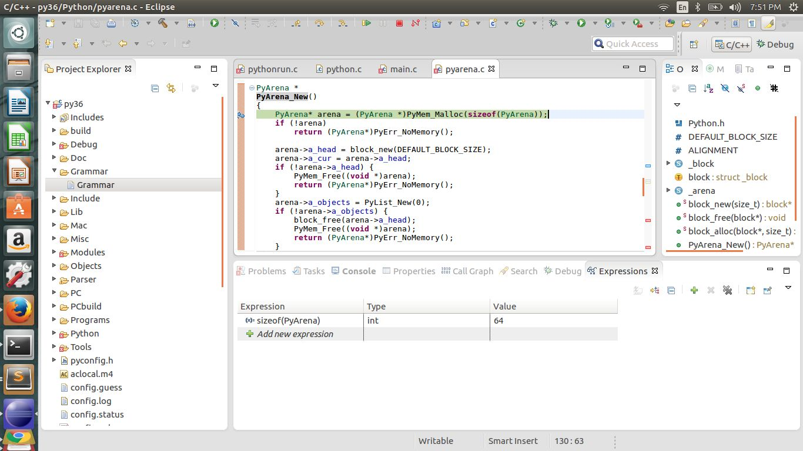

## Chapter 2

## Advanced​ ​ Parsing​ ​ concepts

## Topic​ ​ 1.1​ ​ : ​ ​ How​ ​ are​ ​ arena’s​ ​ used​ ​ in​ ​ memory​ ​ allocation​ ​ for​ ​ parsing​ ​ ? 

Let​ ​ us​ ​ begin​ ​ our​ ​ discussion​ ​ from​ ​ the​ ​ file​ ​ pythonrun.c​ ​ on​ ​ line​ ​ number​ ​ 910.​ ​ Let​ ​ us​ ​ observe​ ​ the snippet​ ​ of​ ​ code​ ​ as​ ​ in​ ​ listing​ ​ 1.1 

Listing​ ​ 1.1

'''c
     	PyObject​​ ​ *
	PyRun_FileExFlags​ ( ​ FILE​ ​ * ​ fp​ , ​ ​ const​​ ​ char​​ ​ * ​ filename_str​ , ​ ​ int​​ ​ start​ , ​ ​ PyObject *​ globals,
​ ​ ​ ​ ​ ​ ​ ​ ​ ​ ​ ​ ​ ​ ​ ​ ​ ​ PyObject​​ ​ * ​ locals​ , ​ ​ int​​ ​ closeit​ , ​ ​ PyCompilerFlags​​ ​ * ​ flags)
	{
​ ​ ​ ​ 	 PyObject​​ ​ * ​ ret​ ​ = ​ ​ NULL;
​ ​ ​ ​ 	 mod_ty​ ​ mod;
​ ​ ​ ​ 	 PyArena​​ ​ * ​ arena​ ​ = ​ ​ NULL;
​ ​ ​ ​	 PyObject​​ ​ * ​ filename;
​  ​ ​ 	 filename​ ​ = ​ ​ PyUnicode_DecodeFSDefault​ ( ​ filename_str​ );
​ ​ ​ ​ 	 if​​ ​ ( ​ filename​ ​ ==​​ ​ NULL)
​ ​ ​ ​ ​ ​ ​ ​ 	goto​​ ​ exit;
​	
	 arena​ ​ = ​ ​ PyArena_New​ ();​​ ​ //​ ​ 1
​	 ​if​​ ​ ( ​ arena​ ​ ==​​ ​ NULL)
​ ​ ​ ​ ​ ​ ​ ​ 	goto​​ ​ exit;
​ ​ ​ 	mod​ ​ = ​ ​ PyParser_ASTFromFileObject​ ( ​ fp​ , ​ ​ filename​ , ​ ​ NULL​ , ​ ​ start​ , ​ ​ 0 ​ , ​ ​ 0,
​ ​ ​ ​ ​ ​ ​ ​ ​ ​ ​ ​ ​ ​ ​ ​ ​ ​ ​ ​ ​ ​ ​ ​ ​ ​ ​ ​ ​ ​ ​ ​ ​ ​ ​ ​ ​ flags​ , ​ ​ NULL​ , ​ ​ arena​ );​​ ​ //​ ​ 2
'''

Observations​ ​ from​ ​ listing​ ​ 1.1 
 
	1. We​ ​ observe​ ​ that​ ​ a ​ ​ new​ ​ arena​ ​ for​ ​ memory​ ​ management​ ​ is​ ​ created. 
	2. The​ ​ arena​ ​ is​ ​ passed​ ​ to​ ​ the​ ​ parser​ ​ and​ ​ is​ ​ used​ ​ during​ ​ the​ ​ construction​ ​ of​ ​ the​ ​ Abstract Syntax​ ​ Tree​ ​ from​ ​ the​ ​ parse​ ​ tree. 
 
The​ ​ PyArena​ ​ structure​ ​ is​ ​ declared​ ​ in​ ​ the​ ​ file​ ​ Python/pyarena.c​ ​ and​ ​ is​ ​ shown​ ​ in​ ​ listing​ ​ 1.2
 
Listing​ ​ 1.2:

```c
    struct​​ ​ _arena​ ​ {
​ ​ ​ ​ 
	/*​ ​ Pointer​ ​ to​ ​ the​ ​ first​ ​ block​ ​ allocated​ ​ for​ ​ the​ arena,​ ​ never​ ​ NULL.
​ ​ ​ ​ ​ ​ ​ 	It​​ ​ is​​ ​ used​ ​ only​ ​ to​ ​ find​ ​ the​ ​ first​ ​ block​ ​ when​​ the​ ​ arena​ ​ is being​ ​ freed.
	*/
​
	 ​ ​ ​ block​ ​ * ​ a_head​ ; ​ ​ //​ ​ 1
​

​	 ​ /*​ ​ Pointer​ ​ to​ ​ the​ ​ block​ ​ currently​ ​ used​ ​ for​ ​ allocation.​ ​ ​ It's ​ ab_next​ ​ field​ ​ should​ ​ be​ ​ NULL​ . ​ ​ ​ If​​ ​ it​ ​ is​​ ​ not​ - ​ null​​ ​after​ ​ a​ call​ ​ to​ ​ block_alloc​ (),​​ ​ it​ ​ means​ ​ a ​ ​ new​​ ​ block​ ​ has​ ​ been​ ​ allocated and​​ ​ a_cur​ ​ should​ ​ be​ ​ reset​ ​ to​ ​ point​ ​ it.
​	 ​ */
​
	block​ ​ * ​ a_cur​ ; ​ ​ //​ ​ 2
​
​
​	 ​ /*​ ​ A ​ ​ Python​ ​ list​ ​ object​ ​ containing​ ​ references​ ​ to​ ​ all​ the​ ​ PyObject​ ​ pointers​ ​ associated​ ​ with​​ ​ this​​ ​ area​ . ​ ​ ​ They​​ ​ will​ ​ be​ ​ DECREFed​ ​ when​​ ​ the​ ​ arena​ ​ is​​ ​ freed.
​ 	*/
​ 	
	PyObject​​ ​ * ​ a_objects​ ; ​ ​ //​ ​ 3

	# if​ ​ defined(Py_DEBUG)
​
 ​ ​ ​ 	/*​ ​ Debug​ ​ output​ ​ */
​
 ​ ​ ​ 	size_t​​ ​ total_allocs;
​
	size_t​​ ​ total_size;
​
	size_t​​ ​ total_blocks;
​
	size_t​​ ​ total_block_size;
​
	size_t​​ ​ total_big_blocks;

	#endif
	};
```

Observations​ ​ from​ ​ Listing​ ​ 1.2:  
 
	1. We​ ​ observe​ ​ that​ ​ the​ ​ arena​ ​ holds​ ​ a ​ ​ reference​ ​ to​ ​ the​ ​ first​ ​ block​ ​ of​ ​ memory​ ​ that​ ​ is​ ​ used in​ ​ allocation.​ ​ The​ ​ block​ ​ data​ ​ structure​ ​ which​ ​ is​ ​ represented​ ​ in​ ​ Listing​ ​ 1.3​ ​ is​ ​ organized as​ ​ a ​ ​ linked​ ​ list​ ​ of​ ​ blocks. 

2. The​ ​ block​ ​ that​ ​ is​ ​ currently​ ​ used​ ​ to​ ​ allocate​ ​ data​ ​ to​ ​ requested​ ​ resources.
 
3. The​ ​ python​ ​ that​ ​ contains​ ​ the​ ​ references​ ​ to​ ​ all​ ​ objects​ ​ allocated​ ​ within​ ​ the​ ​ arena.​ ​ The objects​ ​ will​ ​ be​ ​ reference​ ​ decremented​ ​ when​ ​ the​ ​ arena​ ​ is​ ​ freed.  

Listing​ ​ 1.3:

```c
	typedef​​ ​ struct​​ ​ _block​ ​ {
​ ​ ​ ​	 /*​ ​ Total​ ​ number​ ​ of​ ​ bytes​ ​ owned​ ​ by​ ​ this​ ​ block​ ​ available​ ​ to​ ​ pass​ out.
	
​ ​ ​ ​ 	​ * ​ ​ Read​ - ​ only​ ​ after​ ​ initialization​ . ​ ​ ​ The​​ ​ first​ ​ such​ ​ byte​​ ​ starts​ at

​ ​ ​ ​ ​ 	* ​ ​ ab_mem.

	​ ​ */
​	 ​ ​ ​ size_t​​ ​ ab_size;
​
​
​
​	 ​ /*​ ​ Total​ ​ number​ ​ of​ ​ bytes​ already​ ​ passed​ ​ out.​ ​ ​ The​ ​ next​ ​ byte​ ​ available
​
 ​ 	   * ​ ​ to​ ​ pass​​ ​ out​​ ​ starts​ ​ at​ ab_mem​ ​ + ​ ​ ab_offset.
​
	 ​ */
​	
	size_t​​ ​ ab_offset;
​
​
​	 ​ /*​ ​ An​ ​ arena​ ​ maintains​ ​ a ​ ​ singly-linked,​ ​ NULL-terminated​ ​ list​ ​ of
​
	 ​ * ​ ​ all​ ​ blocks​ ​ owned​ ​ by​​ ​ the​ ​ arena​ . ​ ​ ​ These​​ ​ are​ ​ linked​ ​ via​ ​ the
​
	 ​ * ​ ​ ab_next​ ​ member.
​
	 ​ */
​
	 struct​​ ​ _block​ ​ * ​ ab_next​ ; ​ ​ //​ ​ 1
​
	 ​ ​ ​ /*​ ​ Pointer​ ​ to​ the​ ​ first​ ​ allocatable​ ​ byte​ ​ owned​ ​ by​ ​ this​ ​ block.​ ​ ​ Read-
​ ​ 
​ ​ ​ 	* ​ ​ only​ ​ after​ initialization.
​
 ​ ​ ​ ​ 	*/
​
	 ​ ​ ​ void​​ ​ * ​ ab_mem;

	}​​ ​ block;
```

Observations​ ​ from​ ​ listing​ ​ 1.3:
	
	1. Memory​ ​ within​ ​ the​ ​ arena​ ​ is​ ​ organized​ ​ as​ ​ a ​ ​ linked​ ​ list​ ​ of​ ​ blocks. 

### Sub​ ​ Topic​ ​ 1.1a:​ ​ How​ ​ is​ ​ a ​ ​ PyArena​ ​ allocated​ ​ ? 
 
A​ ​ PyArena​ ​ is​ ​ allocated​ ​ from​ ​ the​ ​ function​ ​ PyArena_New​ ​ declared​ ​ in​ ​ the​ ​ file​ ​ Python/pyarena.c on​ ​ line​ ​ number​ ​ 128. 

Listing​ ​ 1.4

```c
   	PyArena​​ ​ * PyArena_New​ ()

	{
​
	 ​ ​ ​ PyArena​ * ​ ​ arena​ ​ = ​ ​ ( ​ PyArena​​ ​ *)​ PyMem_Malloc​ ( ​ sizeof​ ( ​ PyArena​ ));​​ ​ //​ ​ 1
​
	 ​ ​ ​ if​​ ​ (!​ arena)
​
	 ​ ​ ​ ​ ​ ​ ​ return​​ ​ ( ​ PyArena​ *)​ PyErr_NoMemory​ ();
​​
​	 arena​ ->​ a_head​ ​ = ​ ​ block_new​ ( ​ DEFAULT_BLOCK_SIZE​ );​​ ​ //​ ​ 2
​
	 arena​ ->​ a_cur​ ​ = ​ ​ arena​ ->​ a_head​ ; ​ ​ //​ ​ 3
​	
	 if​​ ​ (!​ arena​ ->​ a_head​ ) ​ ​ {
​
	 ​ ​ ​ ​ PyMem_Free​ ((​ void​​ ​ *)​ arena​ );
​
	 ​ ​ ​ ​ return​​ ​ ( ​ PyArena​ *)​ PyErr_NoMemory​ ();
​ 	}
	
	​ ​ arena​ ->​ a_objects​ ​ = ​ ​ PyList_New​ ( ​ 0 ​ );​​ ​ //​ ​ 4
​ ​
	 ​ ​ if​​ ​ (!​ arena​ ->​ a_objects​ ) ​ ​ {
​
	 ​ ​ ​ ​ ​ ​ ​ block_free​ ( ​ arena​ ->​ a_head​ );
​
	 ​ ​ ​ ​ ​ ​ ​ PyMem_Free​ ((​ void​​ ​ *)​ arena​ );
​
	 ​ ​ ​ ​ ​ ​ ​ return​​ ​ ( ​ PyArena​ *)​ PyErr_NoMemory​ ();
​
	 ​ ​ ​ }

	#if​ ​ defined(Py_DEBUG)
​
	 ​ ​ ​ arena​ ->​ total_allocs​ ​ = ​ ​ 0;
​
	 ​ ​ ​ arena​ ->​ total_size​ ​ = ​ ​ 0;
​	
	 ​ ​ ​ arena​ ->​ total_blocks​ ​ = ​ ​ 1;
​
	 ​ ​ ​ arena​ ->​ total_block_size​ ​ = ​ ​ DEFAULT_BLOCK_SIZE;
​
	 ​ ​ ​ arena​ ->​ total_big_blocks​ ​ = ​ ​ 0;

	#endif
​	
	 ​ ​ ​ return​​ ​ arena;
	
	}
```

Observations​ ​ from​ ​ Listing​ ​ 1.4:
 
1. PyMem_Malloc​ ​ is​ ​ the​ ​ call​ ​ to​ ​ the​ ​ memory​ ​ allocation​ ​ function​ ​ of​ ​ python​ ​ which​ ​ we​ ​ shall discuss​ ​ in​ ​ total​ ​ depth​ ​ in​ ​ the​ ​ coming​ ​ chapters.​ ​ For​ ​ know​ ​ let​ ​ us​ ​ just​ ​ remember​ ​ that​ ​ it returns​ ​ a ​ ​ memory​ ​ location​ ​ managed​ ​ by​ ​ python’s​ ​ memory​ ​ management​ ​ system. 
PyArena​ ​ is​ ​ just​ ​ a ​ ​ layer​ ​ of​ ​ memory​ ​ organization​ ​ above​ ​ python’s​ ​ memory​ ​ manager. 

2. Listing​ ​ 1.5  

3. The​ ​ current​ ​ memory​ ​ object​ ​ allocation​ ​ is​ ​ started​ ​ from​ ​ the​ ​ currently​ ​ allocated​ ​ block a_head. 

4. The​ ​ objects​ ​ in​ ​ the​ ​ arena​ ​ are​ ​ allocated​ ​ into​ ​ a ​ ​ PyList.​ ​ We​ ​ shall​ ​ discuss​ ​ in​ ​ depth​ ​ about Python​ ​ Lists​ ​ in​ ​ the​ ​ coming chapters. 

```c
	static​​ ​ block​ ​ * block_new​ ( ​ size_t​​ ​ size)

	{
​
 ​ ​ ​ 	/*​ ​ Allocate​ ​ header​ ​ and​ ​ block​ ​ as​ ​ one​ ​ unit.
​
 ​ ​ ​ ​ ​ ​ 	ab_mem​ ​ points​ ​ just​ ​ past​ ​ header​ . ​ ​ */
​
 ​ ​ ​ 	block​ ​ * ​ b ​ ​ = ​ ​ ( ​ block​ ​ *)​ PyMem_Malloc​ ( ​ sizeof​ ( ​ block​ ) ​ ​ + ​ ​ size​ );​​ ​ //​ ​ 1
​
 ​ ​ ​ 	if​​ ​ (!​ b)
​
 ​ ​ ​ ​ ​ ​ ​ 	return​​ ​ NULL;
​
 ​ ​ ​	 b ​ ->​ ab_size​ ​ = ​ ​ size;
​
	 ​ ​ ​ b ​ ->​ ab_mem​ ​ = ​ ​ ( ​ void​​ ​ *)(​ b ​ ​ + ​ ​ 1 ​ );
​
	 ​ ​ ​ b ​ ->​ ab_next​ ​ = ​ ​ NULL;
​
	 ​ ​ ​ b ​ ->​ ab_offset​ ​ = ​ ​ ( ​ char​​ ​ *)​ _Py_ALIGN_UP​ ( ​ b ​ ->​ ab_mem​ , ​ ALIGNMENT​ ) ​ ​ - ( ​ char​​ ​ *)(​ b ​ ->​ ab_mem​ );
​ ​	
	 ​ ​ return​​ ​ b;
	
	}
```

Observations​ ​ from​ ​ Listing​ ​ 1.5:

	1. Blocks​ ​ are​ ​ also​ ​ allocated​ ​ from​ ​ the​ ​ python​ ​ memory​ ​ manager. 

### Sub​ ​ Topic​ ​ 1.1b:​ ​ How​ ​ is​ ​ memory​ ​ allocated​ ​ to​ ​ objects​ ​ from​ ​ PyArena​ ​ ? 
 
Memory​ ​ is​ ​ allocated​ ​ to​ ​ objects​ ​ by​ ​ the​ ​ function​ ​ PyArena_Malloc​ ​ defined​ ​ in​ ​ the​ ​ file Python/pyarena.c​ ​ on​ ​ line​ ​ number​ ​ 180.​ ​ Snippet​ ​ is​ ​ attached​ ​ in​ ​ listing​ ​ 1.6
 
 
Listing​ ​ 1.6 

```c 
	
	void​​ ​ * PyArena_Malloc​ ( ​ PyArena​​ ​ * ​ arena​ , ​ ​ size_t​​ ​ size)

	{
​
	 ​ ​ ​ void​​ ​ * ​ p ​ ​ = ​ ​ block_alloc​ ( ​ arena​ ->​ a_cur​ , ​ ​ size​ );​​ ​ //​ ​ 1
​	
	 ​ ​ ​ if​​ ​ (!​ p)
​
	 ​ ​ ​ ​ ​ ​ ​ return​​ ​ PyErr_NoMemory​ ();

	#if​ ​ defined(Py_DEBUG)
​
	 ​ ​ ​ arena​ ->​ total_allocs​ ++;
​
	 ​ ​ ​ arena​ ->​ total_size​ ​ +=​​ ​ size;

	#endif
​
	 ​ ​ ​ /*​ ​ Reset​ ​ cur​ ​ if​ ​ we​ ​ allocated​ ​ a ​ ​ new​ ​ block.​ ​ */
​
	 ​ ​ ​ if​​ ​ ( ​ arena​ ->​ a_cur​ ->​ ab_next​ ) ​ ​ { ​ ​ //​ ​ 2
​
	 ​ ​ ​ ​ ​ ​ ​ arena​ ->​ a_cur​ ​ = ​ ​ arena​ ->​ a_cur​ ->​ ab_next;

	#if​ ​ defined(Py_DEBUG)
​
	 ​ ​ ​ ​ ​ ​ ​ arena​ ->​ total_blocks​ ++;
​
	 ​ ​ ​ ​ ​ ​ ​ arena​ ->​ total_block_size​ ​ +=​​ ​ arena​ ->​ a_cur​ ->​ ab_size;
​
	 ​ ​ ​ ​ ​ ​ ​ if​​ ​ ( ​ arena​ ->​ a_cur​ ->​ ab_size​ ​ > ​ ​ DEFAULT_BLOCK_SIZE)
​
	 ​ ​ ​ ​ ​ ​ ​ ​ ​ ​ ​ ++​ arena​ ->​ total_big_blocks;

	#endif
​
	 ​ ​ ​ }
​
	 ​ ​ ​ return​​ ​ p;
	
	}
```

Observations​ ​ from​ ​ listing​ ​ 1.6: 
 
1. Listing​ ​ 1.7 

2. a_cur​ ​ is​ ​ the​ ​ block​ ​ in​ ​ the​ ​ arena​ ​ where​ ​ the​ ​ memory​ ​ allocations​ ​ occur.​ ​ When​ ​ the​ ​ pointer a_cur->ab_next​ ​ is​ ​ not​ ​ NULL​ ​ it​ ​ means​ ​ a ​ ​ new​ ​ block​ ​ has​ ​ been​ ​ allocated​ ​ in​ ​ the​ ​ arena​ ​ and hence​ ​ a_cur​ ​ has​ ​ to​ ​ point​ ​ to​ ​ the​ ​ new​ ​ block​ ​ allocated. 

Listing​ ​ 1.7  

```c
 
	static​​ ​ void​​ ​ *	block_alloc​ ( ​ block​ ​ * ​ b ​ , ​ ​ size_t​​ ​ size)

	{

	void​​ ​ * ​ p;

	assert​ ( ​ b ​ );

	size​ ​ = ​ ​ _Py_SIZE_ROUND_UP​ ( ​ size​ , ​ ​ ALIGNMENT​ );

	if​​ ​ ( ​ b ​ ->​ ab_offset​ ​ + ​ ​ size​ ​ > ​ ​ b ​ ->​ ab_size​ ) ​ ​ { ​ ​ //​ ​ 1

	/*​ ​ If​ ​ we​ ​ need​ ​ to​ ​ allocate​ ​ more​ ​ memory​ ​ than​ ​ will​ ​ fit​ ​ in the​ ​ default​​ ​ block​ , ​ ​ allocate​ ​ a ​ ​ one​ - ​ off​ ​ block​ ​ that​ ​ is
	exactly​ ​ the​ ​ right​ ​ size​ . ​ ​ */

	/*​ ​ TODO(jhylton):​ ​ Think​ ​ about​ ​ space​ ​ waste​ ​ at​ ​ end​ ​ of​ ​ block​ ​ */

	block​ ​ * ​ newbl​ ​ = ​ ​ block_new(

	size​ ​ < ​ ​ DEFAULT_BLOCK_SIZE​ ​ ?

	DEFAULT_BLOCK_SIZE​ ​ : ​ ​ size​ );

	if​​ ​ (!​ newbl)

	return​​ ​ NULL;

	assert​ (!​ b ​ ->​ ab_next​ );

	b​ ->​ ab_next​ ​ = ​ ​ newbl;

	b​ ​ = ​ ​ newbl;
	
	}
	
	}

	assert​ ( ​ b ​ ->​ ab_offset​ ​ + ​ ​ size​ ​ <=​​ ​ b ​ ->​ ab_size​ );

	p​ ​ = ​ ​ ( ​ void​​ ​ *)(((​ char​​ ​ *)​ b ​ ->​ ab_mem​ ) ​ ​ + ​ ​ b ​ ->​ ab_offset​ );​​ ​ //​ ​ 2
	
	b​ ->​ ab_offset​ ​ +=​​ ​ size​ ; ​ ​ //​ ​ 3

	return​​ ​ p;
	
	}
```

Observations​ ​ from​ ​ Listing​ ​ 1.7: 
 
1. ab_offset​ ​ is​ ​ the​ ​ offset​ ​ from​ ​ the​ ​ base​ ​ memory​ ​ location​ ​ free​ ​ to​ ​ be​ ​ allocated​ ​ within​ ​ the block.​ ​ When​ ​ b->ab_offset​ ​ + ​ ​ size​​ > ​ ​ b->ab_size​ ​ implies​ ​ when​ ​ memory​ ​ to​ ​ be​ ​ allocated​ ​ is insufficient​ ​ within​ ​ the​ ​ block​ ​ a ​ ​ new​ ​ block​ ​ is​ ​ allocated. 
2. The​ ​ current​ ​ pointer​ ​ to​ ​ be​ ​ allocated​ ​ is​ ​ offset​ ​ from​ ​ the​ ​ base​ ​ memory​ ​ location​ ​ of​ ​ the block. 
3. The​ ​ offset​ ​ is​ ​ shifted​ ​ to​ ​ the​ ​ next​ ​ allocatable​ ​ memory​ ​ chunk​ ​ within​ ​ the​ ​ block​ ​ with​ ​ size as​ ​ passed​ ​ to​ ​ the​ ​ function. 
 
Memory​ ​ Representation​ ​ of​ ​ a ​ ​ PyArena. 


### Use​ ​ Case​ ​ Studies​ ​ of​ ​ PyArena 

Use​ ​ case​ ​ 1:​ ​ Listing​ ​ 1.8:​ ​ ​ Reference​ ​ from​ ​ asdl.c​ ​ line​ ​ number​ ​ 5.

```c
	asdl_seq​ ​ *
_Py_asdl_seq_new​ ( ​ Py_ssize_t​​ ​ size​ , ​ ​ PyArena​​ ​ * ​ arena)
{
asdl_seq​ ​ * ​ seq​ ​ = ​ ​ NULL;
size_t​​ ​ n;
/*​ ​ check​ ​ size​ ​ is​ ​ sane​ ​ */
if​​ ​ ( ​ size​ ​ < ​ ​ 0 ​ ​ ||
(​ size​ ​ &&​​ ​ (((​ size_t​ ) ​ size​ ​ - ​ ​ 1 ​ ) ​ ​ > ​ ​ ( ​ SIZE_MAX​ ​ / ​ ​ sizeof​ ( ​ void​​ ​ *)))))​​ ​ {
PyErr_NoMemory​ ();
return​​ ​ NULL;
}
n​ ​ = ​ ​ ( ​ size​ ​ ? ​ ​ ( ​ sizeof​ ( ​ void​​ ​ *)​​ ​ * ​ ​ ( ​ size​ ​ - ​ ​ 1 ​ ))​​ ​ : ​ ​ 0 ​ );
/*​ ​ check​ ​ if​ ​ size​ ​ can​ ​ be​ ​ added​ ​ safely​ */
if​​ ​ ( ​ n ​ ​ > ​ ​ SIZE_MAX​ ​ - ​ ​ sizeof​ ( ​ asdl_seq​ ))​​ {
PyErr_NoMemory​ ();
return​​ ​ NULL;
}
n​ ​ +=​​ ​ sizeof​ ( ​ asdl_seq​ );
seq​ ​ = ​ ​ ( ​ asdl_seq​ ​ *)​ PyArena_Malloc​ ( ​ arena​ , ​ ​ n ​ );​​ ​ //​ ​ 1
if​​ ​ (!​ seq​ ) ​ ​ {
PyErr_NoMemory​ ();
return​​ ​ NULL;
}
memset​ ( ​ seq​ , ​ ​ 0 ​ , ​ ​ n ​ );

seq​ ->​ size​ ​ = ​ ​ size;
return​​ ​ seq;
}
```
Observations​ ​ from​ ​ listing​ ​ 1.8: 
 
1. Function​ ​ called​ ​ by​ ​ the​ ​ function​ ​ PyAST_FromNodeObject​ ​ (ast.c​ ​ line​ ​ number​ ​ 761).​ ​ Used to​ ​ construct​ ​ Abstract​ ​ Syntax​ ​ tree​ ​ from​ ​ the​ ​ parse​ ​ tree. 
 
 
### Developer ​ ​ Community ​ ​ Insights ​ ​ ( ​ ​ IRC ​ ​ insights ​ ​ ): 
 
pthewriter:​ ​ I ​ ​ was​ ​ curious​ ​ why​ ​ a ​ ​ new​ ​ system​ ​ of​ ​ memory​ ​ management​ ​ just​ ​ for​ ​ the​ ​ parsing stage.  
 
The​ ​ insights​ ​ from​ ​ the​ ​ community​ ​ was​ ​ as​ ​ follows: 
 
haypo:​ ​ ​ “since​ ​ all​ ​ objects​ ​ used​ ​ for​ ​ parsing​ ​ are​ ​ removed​ ​ after​ ​ parsing​ ​ otherwise,​ ​ it​ ​ would​ ​ put "holes"​ ​ in​ ​ the​ ​ general​ ​ memory​ ​ allocator”.  
 
 
### 1.1c:​ ​ Debugging​ ​ session: 
 
In​ ​ this​ ​ topic​ ​ we​ ​ shall​ ​ look​ ​ at​ ​ debugging​ ​ the​ ​ functioning​ ​ of​ ​ the​ ​ PyArena.  
 
1.1.c.a:​ ​ Debugging​ ​ the​ ​ size​ ​ of​ ​ a ​ ​ PyArena 
 
Insert​ ​ a ​ ​ breakpoint​ ​ on​ ​ the​ ​ file​ ​ pyarena.c​ ​ on​ ​ line​ ​ number​ ​ 130.​ ​ Create​ ​ a ​ ​ watch​ ​ expression​ ​ for the​ ​ size​ ​ of​ ​ PyArena.​ ​ It​ ​ is​ ​ seen​ ​ that​ ​ the​ ​ size​ ​ is​ ​ 64​ ​ bytes. 


